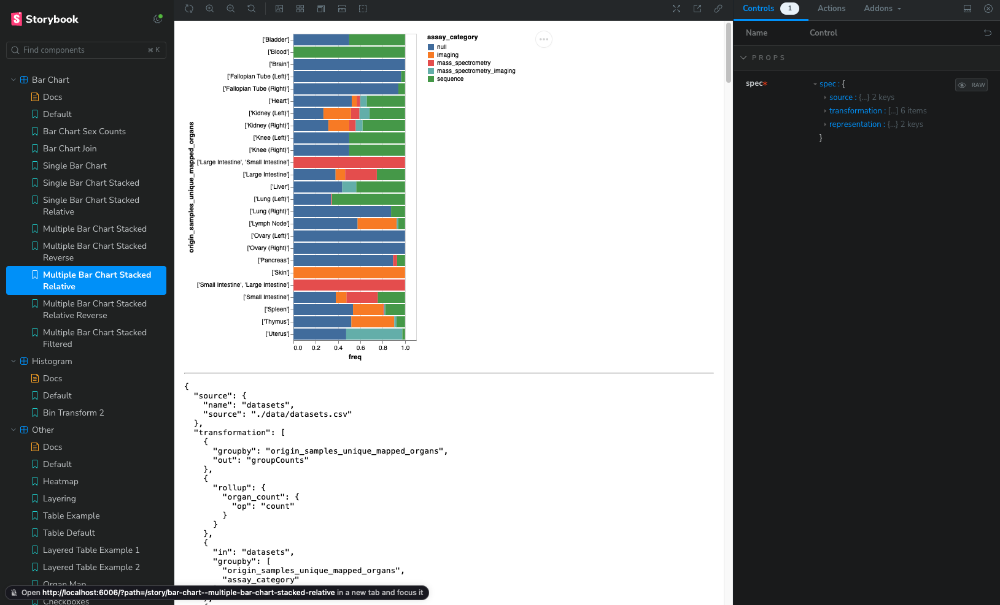

### Universal Discovery Interface Visualization Grammar

This repository contains the current type definitions for the Universal Discovery Interface (UDI) Grammar.

The Grammar is defined with TypeScript typings in [GrammarTypes.ts](./src/stores/GrammarTypes.ts).

The Grammar maps variables to visual encodings. For instance, to create a scatterplot of height and weight we can map `height_value` to `x` and `weight_value` to `y` from the example `donors.csv` file.

```json
{
  "source": {
    "name": "donors",
    "source": "./data/donors.csv"
  },
  "representation": {
    "mark": "point",
    "mapping": [
      {
        "encoding": "y",
        "field": "height_value",
        "type": "quantitative"
      },
      {
        "encoding": "x",
        "field": "weight_value",
        "type": "quantitative"
      }
    ]
  }
}
```

Resulting in a visualization that would look like:


Scatterplots are easy since they map rows in data tables directly to marks. However, many visualizations first require transforming the data. For instance to create a bar chart showing the counts of donors faceted by sex requires a data transformation to calculated those counts.

```json
{
  "source": {
    "name": "donors",
    "source": "./data/donors.csv"
  },
  "transformation": [
    {
      "groupby": "sex"
    },
    {
      "rollup": {
        "sex_count": {
          "op": "count"
        }
      }
    }
  ],
  "representation": {
    "mark": "bar",
    "mapping": [
      {
        "encoding": "x",
        "field": "sex",
        "type": "nominal"
      },
      {
        "encoding": "y",
        "field": "sex_count",
        "type": "quantitative"
      }
    ]
  }
}
```


These data transformations can get more complex. For instance to create a relative stacked bar chart with multiple bars can be accomplished with this specification.

```json
{
  "source": {
    "name": "datasets",
    "source": "./data/datasets.csv"
  },
  "transformation": [
    {
      "groupby": "origin_samples_unique_mapped_organs",
      "out": "groupCounts"
    },
    {
      "rollup": {
        "organ_count": {
          "op": "count"
        }
      }
    },
    {
      "in": "datasets",
      "groupby": ["origin_samples_unique_mapped_organs", "assay_category"]
    },
    {
      "rollup": {
        "organ_assay_count": {
          "op": "count"
        }
      }
    },
    {
      "in": ["datasets", "groupCounts"],
      "join": "origin_samples_unique_mapped_organs",
      "out": "datasets"
    },
    {
      "derive": {
        "freq": "d.organ_assay_count / d.organ_count"
      }
    }
  ],
  "representation": {
    "mark": "bar",
    "mapping": [
      {
        "encoding": "x",
        "field": "freq",
        "type": "quantitative"
      },
      {
        "encoding": "y",
        "field": "origin_samples_unique_mapped_organs",
        "type": "nominal"
      },
      {
        "encoding": "color",
        "field": "assay_category",
        "type": "nominal"
      }
    ]
  }
}
```


## 🚅 Quick start for developers

1.  **Clone the repository.**

    ```shell
    git clone https://github.com/hms-dbmi/udi-grammar
    ```

1.  **Install the dependencies.**

    ```shell
    # Navigate to the directory
      cd udi-grammar

    # Install the dependencies
    yarn
    ```

1.  **Browse your stories with storybook.**

    UDI-Grammar uses [storybook](https://storybook.js.org/) to test the grammar with individual stories.

    Run `yarn storybook` to see stories at `http://localhost:6006`

    
